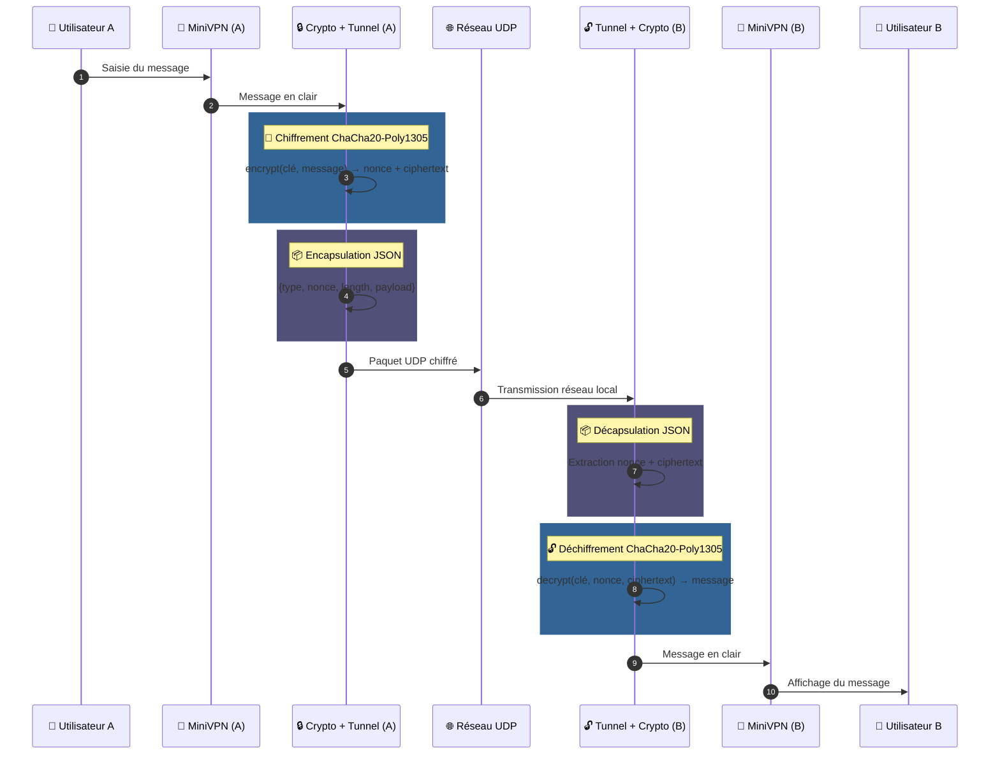
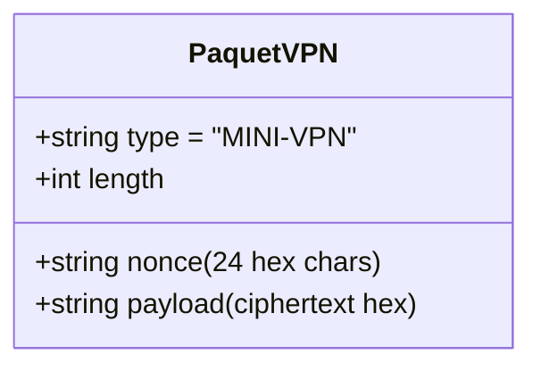

# VPN Niveau 1 – Application Multi-écrans

## Description

Cette application est une implémentation pédagogique d’un VPN (Virtual Private Network) de niveau 1, conçue pour illustrer les principes de base du chiffrement, de l’encapsulation et du transport de paquets via UDP. Elle propose une interface utilisateur textuelle (TUI) multi-écrans développée avec Textual, permettant de visualiser et manipuler chaque étape du processus VPN dans le terminal.

## Fonctionnalités principales

- **Chiffrement des données** : Utilisation d’un algorithme de chiffrement symétrique (défini dans le code, non modifiable par l’utilisateur) pour sécuriser les messages.
- **Encapsulation** : Ajout d’en-têtes pour simuler le transport de paquets VPN.
- **Transport UDP** : Envoi et réception de paquets via le protocole UDP.
- **Interface multi-écrans** : Navigation entre plusieurs écrans pour visualiser chaque étape (saisie, chiffrement, encapsulation, transmission, réception, déchiffrement).

## Structure du projet

- `crypto.py` : Fonctions de chiffrement/déchiffrement.
- `messages.py` : Gestion des messages et des formats de paquets.
- `minivpn.py` : Logique principale de l’application VPN.
- `screens.py` : Gestion de l’interface multi-écrans.
- `settings.py` : Paramètres de configuration (clés, ports, etc.).
- `tunnel.py` : Gestion du tunnel VPN (simulation).
- `udp.py` : Fonctions d’envoi/réception UDP.
- `style.css` : Style de l’interface graphique.

## Installation

1. Cloner le dépôt :

   ```bash
   git clone "https://github.com/remiv1/vpn.git"
   ```

2. Installer les dépendances :

   ```bash
   pip install -r requirements.txt
   ```

## Lancement de l’application

Depuis le dossier `src/n1/vpn1_multiscreen` :

```bash
python minivpn.py
```

Lancer l'application sur deux terminaux distincts pour simuler l'envoi et la réception des messages via le VPN et branchés sur le même réseau local.

## Utilisation

1. Saisir un message à envoyer.
2. Suivre le parcours du message à travers les différentes étapes (chiffrement, encapsulation, transmission, réception, déchiffrement).
3. Envoyer et recevoir des messages via l’interface TUI.
4. Essayer de modifier la clé de chiffrement dans `settings.py` pour observer l’impact sur le déchiffrement.

## Schéma de fonctionnement



### Flux de données détaillé

```mermaid
flowchart LR
    subgraph Émetteur
        A[Message clair] --> B[ChaCha20-Poly1305]
        B --> C[Nonce + Ciphertext]
        C --> D[Encapsulation JSON]
        D --> E[Paquet VPN]
    end
    
    E --> |UDP| F[Réseau]
    
    subgraph Récepteur
        F --> G[Paquet VPN]
        G --> H[Décapsulation JSON]
        H --> I[Nonce + Ciphertext]
        I --> J[ChaCha20-Poly1305]
        J --> K[Message clair]
    end
    
    style B fill:#2d5a87
    style J fill:#2d5a87
    style D fill:#4a4a6a
    style H fill:#4a4a6a
```



### Structure du paquet VPN



## Auteurs

- Projet pédagogique – Audit IO
- Développeur : Rémi Verschuur

## Licence

Ce projet est distribué sous licence MIT.
